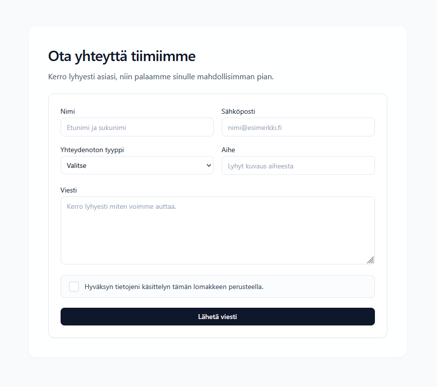
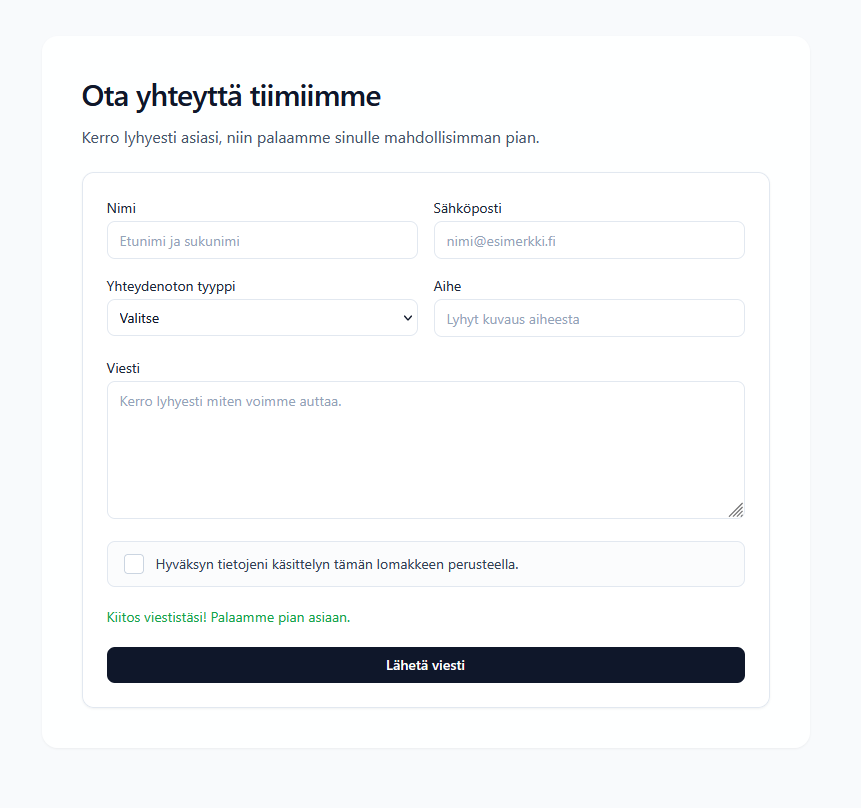
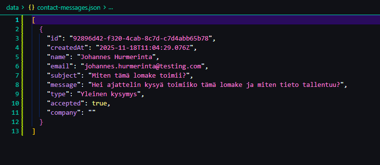
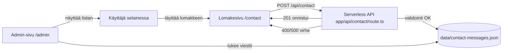

# Seminaarityö: Next.js-yhteydenottopalvelu

## Johdanto
Tämän seminaarityön tavoitteena oli toteuttaa pieni mutta teknisesti selkeä fullstack-kokonaisuus Next.js:n avulla. Ratkaisuna rakennettiin yhteydenottolomake, joka lähettää käyttäjän syötteet serverless-rajapinnalle, validoi datan palvelinpuolella ja tallentaa viestit JSON-tiedostoon. Projekti on rajattu tarkoituksella yksinkertaiseksi, mutta se sisältää riittävästi syvyyttä (frontend–backend–tiedostotallennus), jotta työn tavoitteet ja oppiminen on helppo osoittaa.

## Tavoitteet
- Ymmärtää Next.js App Router -arkkitehtuuria sekä client–server -rajapintaa.  
- Toteuttaa lomake, joka sisältää client-validaation, tilahallinnan ja virheilmoitukset.  
- Rakentaa serverless-API, joka validoi ja käsittelee datan luotettavasti.  
- Tallentaa saapuvat viestit JSON-muodossa ilman ulkoista tietokantaa.  
- Käsitellä onnistuneet lähetykset, validointivirheet ja virhetilanteet järkevästi.

## Teknologiat
- Next.js 16 / App Router  
- TypeScript  
- Tailwind CSS  
- Node.js fs API  

## Projektin rakenne
app/
  page.tsx
  contact/page.tsx
  api/contact/route.ts
components/
  ContactForm.tsx
data/
  contact-messages.json

## Toteutus

### Lomake
ContactForm.tsx hallinnoi syötekenttiä, client-validointia ja palautteen näyttämistä. Lähetyksen aikana painike lukittuu ja onnistumisen jälkeen lomake tyhjennetään.

### API route
app/api/contact/route.ts:
- hyväksyy vain POST  
- validoi kentät  
- estää honeypot-botit  
- lisää id + createdAt  
- tallentaa JSON-tiedostoon  

### JSON-tallennus
Viestit tallennetaan data/contact-messages.json -tiedostoon. Jos tiedosto puuttuu, luodaan tyhjä taulukko.

## Validointi ja anti-spam
- Kaikki kentät pakollisia  
- accepted-kentän oltava true  
- company-kenttä toimii honeypotina  

## Kuvankaappaukset

## Arkkitehtuurikaavio

## Video
TODO

## Oppimiskokemukset

Työn aikana syvennyin erityisesti siihen, miten Next.js App Router yhdistää frontendin ja backendin saman koodipohjan alle. Aikaisemmin olin käyttänyt Reactia pääasiassa selaimen puolella, mutta tässä projektissa jouduin miettimään selkeästi, mitä ajetaan clientissä ja mitä palvelimella. Esimerkiksi lomakekomponentti on puhdas client-komponentti, kun taas API route ja viestien luku admin-näkymää varten toimivat vain palvelinympäristössä.

Serverless-rajapinnan toteutus auttoi ymmärtämään paremmin HTTP-pyyntöjen elinkaarta ja sitä, miksi pelkkä client-validaatio ei riitä. Käytännössä sama data validoidaan kahteen kertaan: ensin selaimessa, jotta käyttäjä saa välittömän palautteen, ja sen jälkeen palvelimella, jotta tietoturva ja datan eheys voidaan varmistaa. Tässä yhteydessä honeypot-kenttä oli yksinkertainen, mutta toimiva tapa suojautua automatisoiduilta bottiviesteiltä.

Tiedostopohjainen tallennus `fs`-APIn avulla oli hyvä tapa konkretisoida, mitä palvelin oikeasti tekee datalla. Samalla oli pakko pohtia ratkaisun rajoitteita: JSON-tiedosto ei skaalaudu kovin pitkälle, rinnakkaiset kirjoitukset voivat olla ongelma, eikä ratkaisu sovellu suoraan horisontaalisesti skaalautuvaan tuotantoympäristöön. Nämä havainnot oli helppo kytkeä jatkokehitysideoihin, kuten tietokannan käyttöönottoon tai Supabasen hyödyntämiseen.

Admin-näkymän lisääminen auttoi myös katsomaan ratkaisua “kokonaisuutena”, ei vain yksittäisenä endpointina. Kun viestit luettiin takaisin samasta JSON-lähteestä ja näytettiin erillisellä sivulla, sovellus alkoi tuntua enemmän oikealta pieneltä järjestelmältä kuin yksittäiseltä lomakedemolta. Tämä vahvisti ymmärrystäni siitä, miten fullstack-sovelluksen eri kerrokset keskustelevat keskenään ja miten samaa dataa kuljetetaan läpi käyttöliittymän, API-kerroksen ja tallennusratkaisun.

## Jatkokehitysideoita
- sähköposti-ilmoitukset  
- admin-näkymä toimimaan authentikoinnilla
- captcha  
- tietokanta  
- validointikirjastot  

## Lähteet
Next.js Dokumentaatio – https://nextjs.org/docs  
Node.js File System (fs) – https://nodejs.org/api/fs.html  
Tailwind CSS Dokumentaatio – https://tailwindcss.com/docs